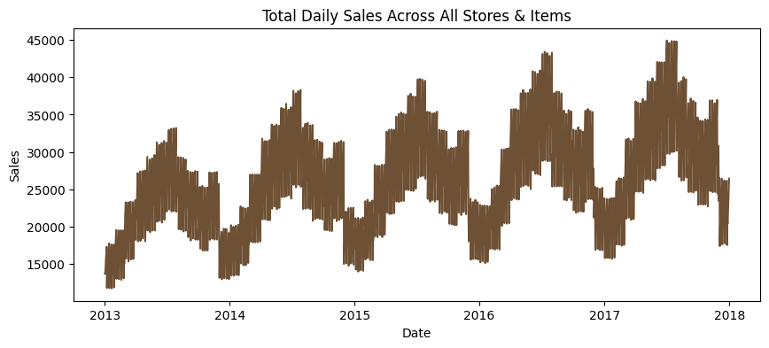
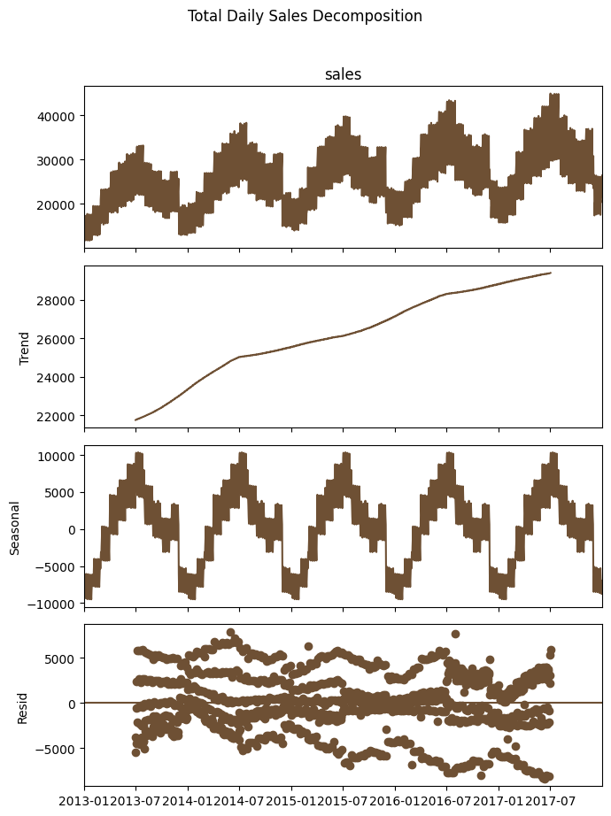
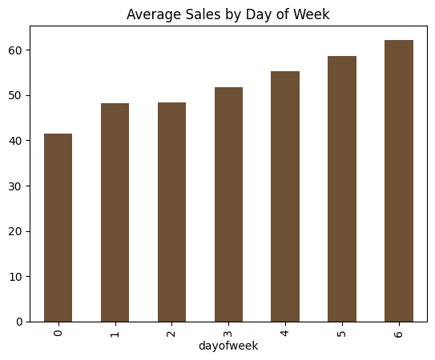
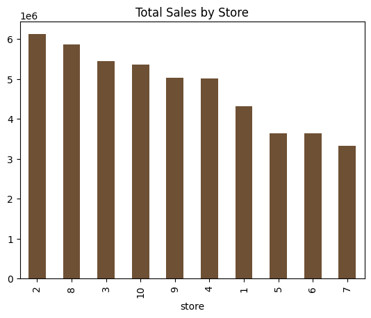
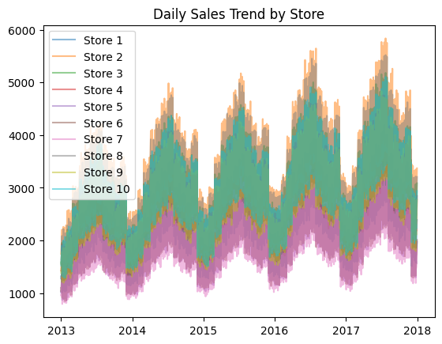
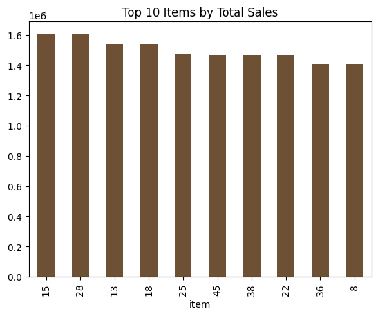
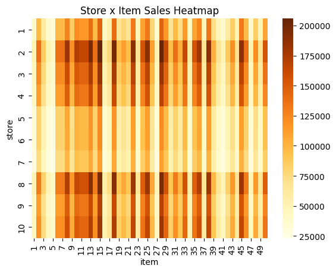
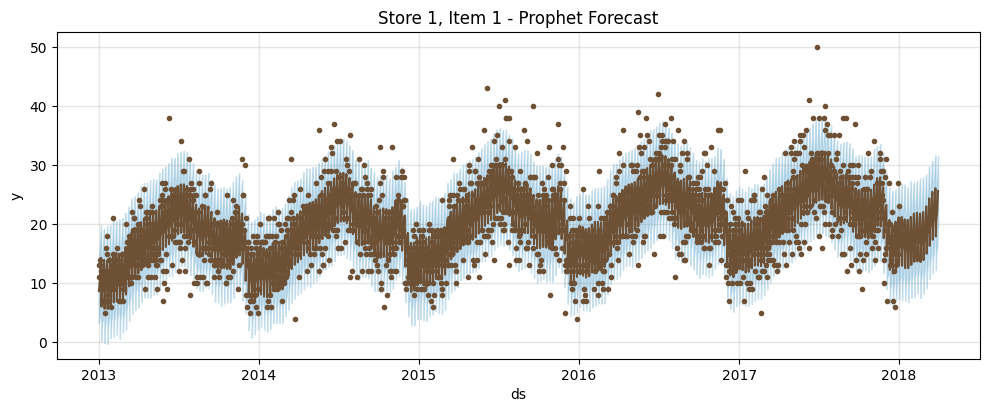
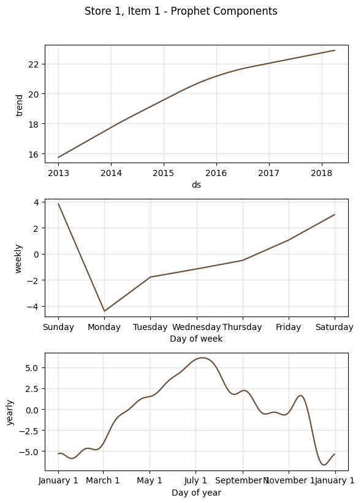
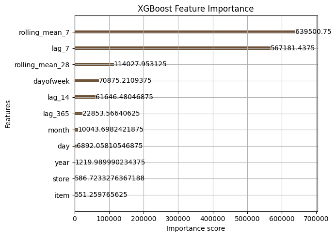

## Abstract
This is a time series demand forecasting project that uses 5 years of historical store-item level retail sales data to predict future demand. The project explores exploratory data analysis, time series decomposition, feature engineering and model comparison to understand what drives sales patterns across different stores and items. In addition to prediction, the analysis examines how trend, seasonality and short-term sales momentum relate to forecasting accuracy. It also demonstrates how forecasting models can support inventory planning and replenishment decisions in a supply chain context.

## Project Motivation
Demand forecasting is a core analytical skill in supply chain and retail operations, where accurate forecasts directly inform inventory planning, replenishment cycles and stockout prevention. This project was undertaken to apply forecasting techniques to a supply chain context, using the Kaggle Store Item Demand Forecasting dataset to predict daily sales for 10 stores and 50 items and comparing a seasonal baseline against Prophet and XGBoost to identify which approach best captures underlying demand patterns.

## Key Question
This project set out to answer three core questions:
1. Which forecasting approach, seasonal baseline, Prophet or XGBoost, produces the most accurate demand forecasts across 500 store-item combinations?
2. What features drive short-term demand the most: recent sales momentum, calendar effects (day of week, month) or long-term seasonality (same period last year)?
3. Do individual stores and items require separate models, or can a single global model capture shared demand patterns across locations and products?

## Dataset
The dataset is from Kaggle's Store Item Demand Forecasting Challenge, containing daily sales records from 2013–2017 across 10 stores and 50 items. Key variables include:
- date – date of the sale record
- store – store ID (1–10)
- item – item ID (1–50)
- sales – number of units sold at a given store, for a given item, on a given day

The dataset explicitly excludes holiday effects and store closures, so all observed seasonality reflects underlying demand patterns rather than calendar disruptions.

## Exploratory Data Analysis

### Overall Sales Trend

*  Clear annual growth trend: each year’s peak is higher than the previous year’s, increasing from around 33,000 in 2013 to about 45,000 in 2017.
*  Strong seasonality: the same pattern repeats every year, which sales are lower at the beginning of the year, rise sharply during the summer and decline again toward the end of the year. This creates a  consistent one-year cycle.
*  Short-term zigzag fluctuations: these may reflect a day-of-week effect, such as higher sales on weekends than on weekdays. We can further decompose the data later to verify whether this pattern is indeed driven by weekly seasonality.
  
### Seasonal Decomposition

*   Trend: after removing short-term fluctuations, we focus only on the overall direction. The trend line rises steadily from 22,000 in 2013 to about 29,000 in 2017. This suggests that the business itself is growing over time. The increase is not caused by seasonality.
*   Seasonal: this represents the fixed pattern that repeats every year. The values fluctuate regularly between roughly -10,000 and +10,000, with one cycle each year. This suggests that sales are naturally higher in the summer and lower in the winter. It is a predictable seasonal pattern rather than random variation.
*   Resid/residual: after removing both the trend and seasonal components, this is the variation that remains unexplained. The residuals appear to stay roughly between -5,000 and +5,000, without getting wider or narrower over time. Overall, they look relatively stable, with no obvious unusual pattern.

### Day-of-Week Effect

Day-of-week effect:
*   Monday (0) has the lowest sales, at around 41.
*   Sales increase steadily from Monday through Sunday, with Friday, Saturday and Sunday (4, 5, 6) showing noticeably higher sales.
*   Sunday (6) has the highest sales of the week, at around 62 — nearly 50% higher than Monday.

### Store-Level Comparison

*  Store 2 has the highest sales, while Store 7 has the lowest.
*  There are noticeable differences across stores, but the gaps are not large enough to justify building a separate model for each store.
*  Instead, store should be included as a feature in the model so it can account for store-level differences.

*  The curves for all 10 stores are nearly identical in shape, showing the same seasonality and overall growth trend, with the main difference being their sales levels (magnitude).
*  This suggests that the seasonal patterns and time trends are shared across stores, so there is no need to model seasonality separately for each store.

### Item-Level Comparison

*   The top 10 items have relatively similar sales levels, with no clear 80/20 concentration effect.
*   This suggests that sales are fairly evenly distributed across items, rather than being driven primarily by a small number of best-selling products.

### Store x Item Interaction

*   There is clear horizontal banding: the same items show very similar sales patterns across different stores. For example, Items 15 and 28 consistently have higher sales across nearly all stores.
*   This suggests that item popularity is largely consistent across locations, with no strong evidence of distinct regional preferences.
*   The main differences are driven by the overall sales level of each store, rather than differences in which items customers prefer.

## Forecasting Models
### Baseline: Naive Seasonal Baseline
Forecasts each day's sales as equal to the same day one year prior, providing a minimum performance bar with no statistical modeling involved.

**MAPE: 23.42%** | **RMSE: 14.96**

### Model 2: Prophet
An additive time series model fit independently for each of the 500 store-item combinations, automatically decomposing each series into trend, weekly seasonality, and yearly seasonality.

The decomposition confirms Prophet is capturing the same patterns identified in EDA: a steady upward trend, a weekly cycle peaking on Sundays, and a yearly cycle peaking in summer.

**MAPE: 14.15%** | **RMSE: 8.26**

### Model 3: XGBoost
A single global gradient-boosted tree model trained across all 500 store-item combinations at once, using engineered calendar, lag and rolling-average features along with store and item as categorical inputs.

 
**MAPE: 13.03%** | **RMSE: 7.67**

### Model Comparison

| Model | MAPE | RMSE |
|---|---|---|
| Seasonal Naive Baseline | 23.42% | 14.96 |
| Prophet (all 500 combinations) | 14.15% | 8.26 |
| **XGBoost** | **13.03%** | **7.67** |

XGBoost achieved the best performance on both metrics, improving MAPE by 44% and RMSE by 49% relative to the baseline, and modestly outperforming Prophet on both metrics. This is consistent with the EDA finding that seasonality and item popularity patterns are shared across stores — a single global model with store/item as features can learn from the full dataset at once, rather than fitting 500 independent models as Prophet does.
